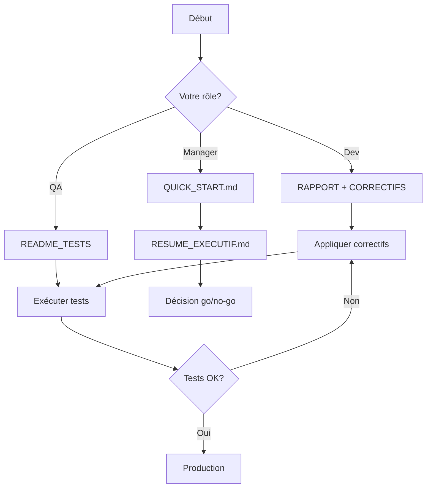

# 📚 INDEX - Documentation Tests Critiques Backend

Bienvenue dans la documentation complète des tests de fonctionnalités critiques du backend Lamb Platform.

---

## 📁 Structure des Fichiers

```
lamb/tests/
├── 📄 QUICK_START.md                    (1.9K)  ← ⭐ COMMENCER ICI
├── 📄 RESUME_EXECUTIF.md                (11K)   ← Pour les managers
├── 📄 RAPPORT_TESTS_CRITIQUES.md        (12K)   ← Pour les développeurs
├── 📄 CORRECTIFS_A_APPLIQUER.md         (14K)   ← Code des solutions
├── 📄 README_TESTS_CRITIQUES.md         (11K)   ← Guide d'utilisation
└── 📄 critical-features.test.ts         (37K)   ← Fichier de tests
```

---

## 🚀 Par où commencer ?

### 👨‍💼 Vous êtes Manager / Product Owner
**Lire en priorité**:
1. ⚡ `QUICK_START.md` (lecture: 1 min)
   - Résultat global
   - Problème critique identifié
   - Actions immédiates requises

2. 📊 `RESUME_EXECUTIF.md` (lecture: 5 min)
   - Rapport détaillé avec métriques
   - Tableaux de scores
   - Décision go/no-go pour production

---

### 👨‍💻 Vous êtes Développeur
**Lire dans cet ordre**:
1. ⚡ `QUICK_START.md` (1 min)
   - Vue d'ensemble rapide

2. 📖 `RAPPORT_TESTS_CRITIQUES.md` (10 min)
   - Détails techniques de chaque test
   - Analyse des failures
   - Points forts du backend

3. 🔧 `CORRECTIFS_A_APPLIQUER.md` (15 min)
   - Code complet des correctifs
   - Explications ligne par ligne
   - Checklist d'application

4. 📚 `README_TESTS_CRITIQUES.md` (5 min)
   - Comment exécuter les tests
   - Interprétation des résultats
   - Débogage

---

### 🧪 Vous êtes QA / Testeur
**Lire dans cet ordre**:
1. 📚 `README_TESTS_CRITIQUES.md`
   - Guide d'exécution complet
   - Prérequis
   - Résultats attendus

2. 📊 `RESUME_EXECUTIF.md`
   - Détails de chaque test
   - Scénarios de test
   - Critères de réussite

3. ⚡ `QUICK_START.md`
   - Commandes rapides

---

## 📄 Description Détaillée des Fichiers

### ⚡ QUICK_START.md
**Taille**: 1.9K  
**Temps de lecture**: 1 minute  
**Pour qui**: Tous  
**Contenu**:
- ✅ Résultat global: 8/9 tests réussis
- 🚨 Problème critique: Race condition
- 📋 Actions immédiates
- ✔️ Checklist de déploiement

**Quand l'utiliser**: 
- Première lecture
- Briefing rapide d'équipe
- Stand-up meeting

---

### 📊 RESUME_EXECUTIF.md
**Taille**: 11K  
**Temps de lecture**: 5-10 minutes  
**Pour qui**: Managers, Tech Leads, Product Owners  
**Contenu**:
- 📊 Tableau récapitulatif des 9 tests
- 🎯 Points forts du backend (7 catégories)
- 🚨 Point faible critique détaillé
- 📈 Métriques de qualité avec scores
- 🎯 Décision finale go/no-go
- 📞 Prochaines étapes

**Quand l'utiliser**:
- Présentation aux stakeholders
- Prise de décision de déploiement
- Reporting de sprint

---

### 📖 RAPPORT_TESTS_CRITIQUES.md
**Taille**: 12K  
**Temps de lecture**: 10-15 minutes  
**Pour qui**: Développeurs, Tech Leads  
**Contenu**:
- 🔍 Analyse détaillée de chaque test
- ❌ Détails techniques de l'échec du Test 2
- ✅ Validation des 8 tests réussis
- 🐛 Observations techniques (erreurs non-bloquantes)
- 🚨 Actions requises par priorité (P0, P1, P2)
- 📈 Métriques de qualité
- ✅ Checklist avant déploiement

**Quand l'utiliser**:
- Comprendre en profondeur les résultats
- Planifier les correctifs
- Code review
- Documentation technique

---

### 🔧 CORRECTIFS_A_APPLIQUER.md
**Taille**: 14K  
**Temps de lecture**: 15-20 minutes  
**Pour qui**: Développeurs  
**Contenu**:
- 🔴 CORRECTIF 1: Race condition acceptBet (CODE COMPLET)
- 🟠 CORRECTIF 2: Sérialisation BigInt
- 🟠 CORRECTIF 3: Méthode WebSocket manquante
- 🟢 CORRECTIF 4: Améliorer Test 7
- 🟢 CORRECTIF 5: Déduplication des dépôts
- 🟢 CORRECTIF 6: Nettoyage des tests
- ✅ Checklist d'application par phase

**Quand l'utiliser**:
- AVANT d'appliquer les correctifs
- Référence pendant le développement
- Code review des correctifs

**Structure de chaque correctif**:
```
### Problème
  Description du bug

### Solution
  ❌ Code AVANT (vulnérable)
  ✅ Code APRÈS (corrigé)

### Explications
  Pourquoi ça marche

### Test de validation
  Comment vérifier que ça fonctionne
```

---

### 📚 README_TESTS_CRITIQUES.md
**Taille**: 11K  
**Temps de lecture**: 5-10 minutes  
**Pour qui**: QA, Développeurs, DevOps  
**Contenu**:
- 📋 Description des 9 tests couverts
- 🚀 Guide d'exécution étape par étape
- 🐛 Guide de débogage
- 📊 Interprétation des résultats
- 🔍 Points de contrôle critiques
- 📝 Notes importantes et limitations
- ✅ Checklist avant production

**Quand l'utiliser**:
- Première exécution des tests
- Formation d'un nouveau membre
- Débogage de tests échoués
- Vérification pre-production

---

### 🧪 critical-features.test.ts
**Taille**: 37K (976 lignes)  
**Langage**: TypeScript  
**Pour qui**: Développeurs, QA  
**Contenu**:
- ⚙️ Configuration et setup des tests
- 🧪 9 fonctions de test complètes
- 🎨 Logs colorés et formatés
- 🧹 Nettoyage automatique après tests
- 📊 Rapport final automatique

**Structure**:
```typescript
// Configuration
setupTests()           // Créer users, combats, événements

// Tests critiques
test1_DoublePaiement()
test2_AcceptationSimultanee()  ← ❌ Celui qui échoue
test3_BlocageFonds()
test4_RemboursementAnnulation()
test5_CalculGains()
test6_MatchNul()
test7_VictoireLutteur()
test8_SoldeNegatifImpossible()
test9_TestTransactionsGlobal()

// Nettoyage
cleanupTests()

// Main
runAllTests()
```

**Exécution**:
```bash
npx ts-node tests/critical-features.test.ts
```

---

## 🎯 Scénarios d'Utilisation

### Scénario 1: Premier Regard
**Objectif**: Comprendre rapidement la situation  
**Temps**: 5 minutes

```
1. Lire QUICK_START.md (1 min)
2. Lire RESUME_EXECUTIF.md sections "Résultat Global" et "Tests Échoués" (4 min)
```

**Résultat**: Vous savez qu'il y a 1 problème critique à corriger

---

### Scénario 2: Appliquer les Correctifs
**Objectif**: Corriger le problème critique  
**Temps**: 2-4 heures

```
1. Lire QUICK_START.md (1 min)
2. Lire CORRECTIFS_A_APPLIQUER.md - CORRECTIF 1 (15 min)
3. Appliquer le correctif dans BetService.ts (30 min)
4. Tester avec critical-features.test.ts (5 min)
5. Vérifier que Test 2 passe maintenant (1 min)
6. Code review (30 min)
7. Appliquer CORRECTIF 2 et 3 (30 min)
```

**Résultat**: 9/9 tests passent, prêt pour production

---

### Scénario 3: Présentation Stakeholders
**Objectif**: Expliquer la situation au management  
**Temps**: 30 minutes

```
Préparation:
1. Lire RESUME_EXECUTIF.md (10 min)
2. Préparer slides basés sur les métriques (10 min)

Présentation:
3. Slide 1: Résultat global (8/9, 88.9%)
4. Slide 2: Ce qui fonctionne (tableaux de RESUME_EXECUTIF)
5. Slide 3: Problème critique (race condition)
6. Slide 4: Plan d'action (correctifs + timeline)
7. Q&A
```

**Résultat**: Décision informée sur le go/no-go

---

### Scénario 4: Onboarding Nouveau Développeur
**Objectif**: Former un nouveau membre sur les tests critiques  
**Temps**: 1-2 heures

```
1. Lire QUICK_START.md (5 min)
2. Lire README_TESTS_CRITIQUES.md (10 min)
3. Exécuter les tests localement (10 min)
4. Lire RAPPORT_TESTS_CRITIQUES.md (20 min)
5. Examiner critical-features.test.ts (30 min)
6. Questions & discussions (30 min)
```

**Résultat**: Membre autonome sur les tests critiques

---

## 📊 Workflow Recommandé



---

## 🔥 Actions Urgentes (À FAIRE MAINTENANT)

1. **Lire** `QUICK_START.md` (1 min)
2. **Comprendre** le problème critique (Test 2)
3. **Bloquer** le déploiement en production
4. **Assigner** CORRECTIF 1 à un développeur senior
5. **Planifier** 4h de dev pour appliquer les correctifs
6. **Prévoir** une re-validation complète

---

## 📞 Support

**Questions sur les tests?**
- Voir `README_TESTS_CRITIQUES.md` section "Débogage"

**Questions sur les correctifs?**
- Voir `CORRECTIFS_A_APPLIQUER.md`

**Questions générales?**
- Consulter `RESUME_EXECUTIF.md` section "Prochaines étapes"

---

## ✅ Checklist Complète

### Phase 1: Compréhension (30 min)
- [ ] ✅ Lu QUICK_START.md
- [ ] ✅ Lu RESUME_EXECUTIF.md
- [ ] ✅ Informé les stakeholders
- [ ] ✅ Bloqué le déploiement

### Phase 2: Correction (4h)
- [ ] ✅ Lu CORRECTIFS_A_APPLIQUER.md
- [ ] 🔴 Appliqué CORRECTIF 1 (race condition)
- [ ] 🟠 Appliqué CORRECTIF 2 (BigInt)
- [ ] 🟠 Appliqué CORRECTIF 3 (WebSocket)
- [ ] ✅ Code review effectué

### Phase 3: Validation (30 min)
- [ ] ✅ Tests exécutés (9/9 réussis)
- [ ] ✅ Re-validation complète
- [ ] ✅ Documentation mise à jour
- [ ] ✅ Commit + Push

### Phase 4: Déploiement (variable)
- [ ] ✅ Déploiement en staging
- [ ] ✅ Tests manuels en staging
- [ ] ✅ Validation métier
- [ ] ✅ Déploiement en production
- [ ] ✅ Monitoring actif

---

## 📅 Timeline Estimée

| Phase | Durée | Responsable |
|-------|-------|-------------|
| Compréhension | 30 min | Tous |
| Correction CRITIQUE (P0) | 2-4h | Dev Senior |
| Correction IMPORTANT (P1) | 2-4h | Dev |
| Tests & Validation | 1h | QA |
| Code Review | 1h | Tech Lead |
| Déploiement Staging | 30 min | DevOps |
| Tests Staging | 2h | QA |
| Déploiement Prod | 30 min | DevOps |

**TOTAL**: 1-2 jours ouvrés

---

## 🎓 Ressources Additionnelles

- 🔗 Prisma Transactions: https://www.prisma.io/docs/concepts/components/prisma-client/transactions
- 🔗 Race Conditions: https://en.wikipedia.org/wiki/Race_condition
- 🔗 Optimistic Locking: https://www.prisma.io/docs/guides/performance-and-optimization/prisma-client-transactions-guide

---

**Document créé le**: 2025-12-23  
**Dernière mise à jour**: 2025-12-23  
**Version**: 1.0  
**Auteur**: Équipe Lamb Platform
